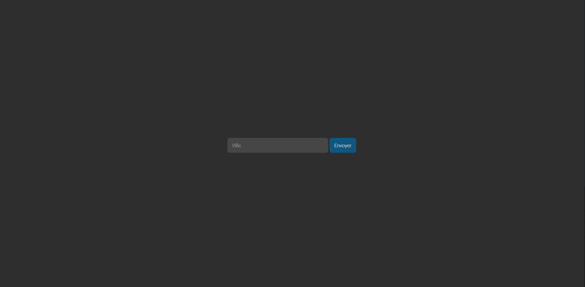
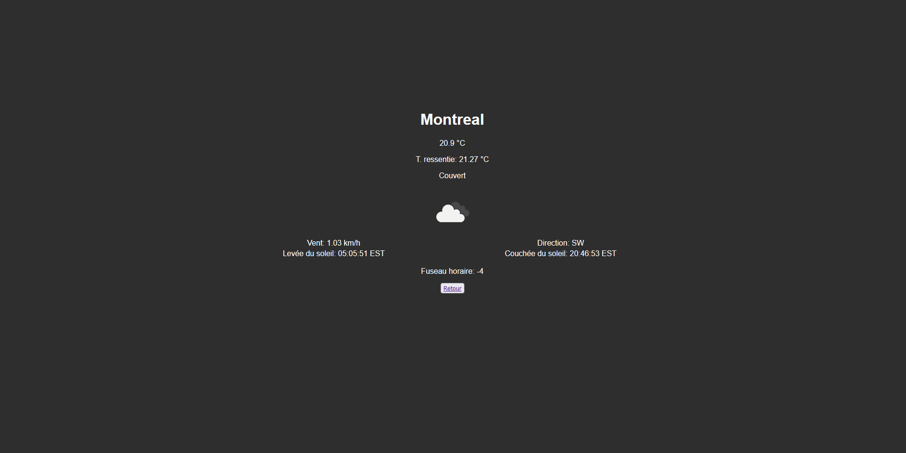
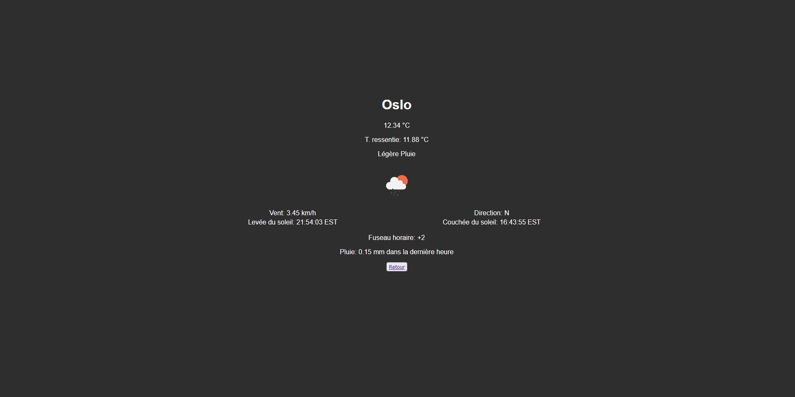

# Weather-App
Weather application using the OpenWeatherMap API  
http://www.chrisgonel.com/weather-app/#/

<!-- <h2>Home Page</h2>
 -->

<!-- <h2>City entered: Montreal</h2> -->
<!--  -->

<!-- <h2>City entered: Oslo</h2> -->
<!--  -->
<!--   -->
